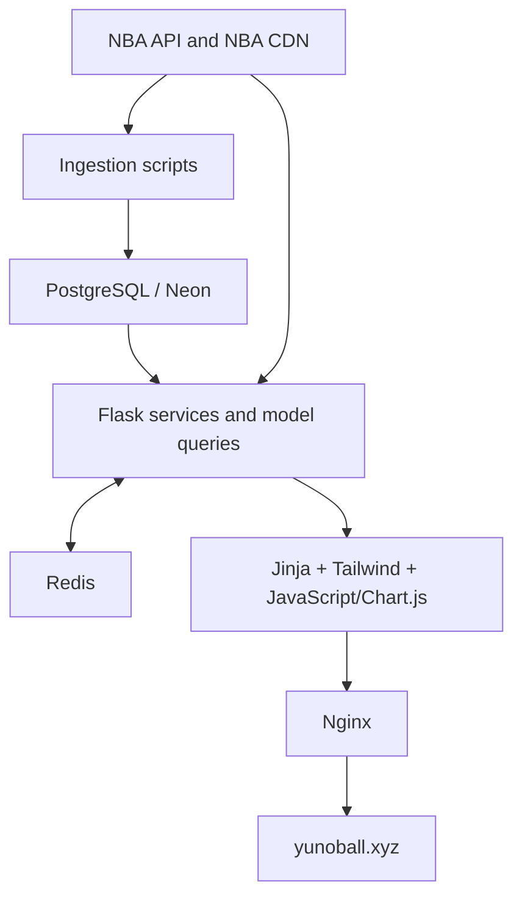

# Yuno Ball Architecture

Status: canonical project context
Reviewed: 2026-07-15 against the local Phase 3 workspace and retained Yuno Ball project context.

## Purpose

Yuno Ball is an NBA analytics web application that ingests NBA data, stores historical and current statistics, and presents team, player, matchup, schedule, standings, and streak views. The repository is canonical for implemented behavior. This document records architecture and intent; future code changes should update it when they alter a boundary or system dependency.

## System overview

## Runtime components

| Component                 | Current responsibility                                                                                     | Primary locations                                                    |
| ------------------------- | ---------------------------------------------------------------------------------------------------------- | -------------------------------------------------------------------- |
| Flask application factory | Creates the app, configures Redis, registers blueprints, injects today's matchups, installs error handlers | `app/__init__.py`                                                    |
| Routes                    | HTTP and template boundary for main, team, player, dashboard, and API features                             | `app/routes/`                                                        |
| Services                  | Assemble multi-table/page data and comparisons                                                             | `app/services/`                                                      |
| Models                    | SQLAlchemy ORM tables plus remaining legacy persistence/query helpers                                      | `app/models/`                                                        |
| Fetch/get utilities       | NBA endpoint calls, normalization, rate limiting, concurrency, and persistence orchestration               | `app/utils/fetch/`, `app/utils/get/`                                 |
| PostgreSQL                | Durable system of record for players, rosters, schedules, game logs, team/player aggregates, and streaks   | connection supplied by untracked/environment-specific `db_config.py` |
| Redis                     | JSON cache for expensive NBA calls and page assemblies                                                     | `app/utils/cache_utils.py`, localhost DB 0                           |
| Front end                 | Server-rendered Jinja templates, compiled Tailwind CSS, client-side JavaScript and Chart.js                | `app/templates/`, `app/static/`, `tailwind.config.js`                |
| Production edge           | Nginx reverse proxy and static files; Gunicorn under systemd                                               | `scripts/deploy.sh`, `scripts/setup_production.sh`                   |
| Background ingestion      | Daily scripts share a durable run/task ledger and PostgreSQL advisory lock; initial/backfill scripts remain separate | `daily_ingest.py`, `daily_fetch.py`, `daily_calculate.py`, `app/services/ingestion_run_service.py` |
| Player snapshot publisher | Builds leakage-safe, versioned player metrics from pre-slate game facts and atomically publishes four metric families | `app/services/player_snapshot_service.py`, `scripts/backfill_player_snapshots.py` |
| Team/game snapshot publisher | Builds curated pregame team form, schedule flags, and paired game environments strictly from pre-cutoff game facts | `app/services/team_snapshot_service.py`, `scripts/backfill_team_game_snapshots.py` |
| Schedule result reconciler | Daily fail-closed repair after team stats and before gamelogs, plus bounded historical recovery; never overwrites non-null results | `app/services/schedule_result_reconciliation_service.py`, `daily_fetch.py`, `scripts/reconcile_schedule_results.py` |

## Request and data flow

1. Nginx receives public traffic and proxies dynamic requests to Gunicorn on `127.0.0.1:8000`.
2. Flask routes call services or model/query helpers.
3. Read paths prefer PostgreSQL for historical data but still call NBA endpoints for live schedule, standings, and lineups.
4. Expensive assembled responses are cached as JSON in local Redis.
5. Scheduled ingestion fetches NBA data and uses table-specific inserts/upserts to refresh PostgreSQL.

## Key architectural decisions

* PostgreSQL is the durable source; Redis is disposable acceleration and must never be the only copy of historical data.
* NBA identifiers are retained as domain keys. Game/team grains normally use `(game_id, team_id)` because each NBA game has two team-perspective rows.
* Flask is organized with an application factory and five blueprints. Services are the intended aggregation boundary, though some route and model methods still call external APIs directly.
* Data loading supports initial, historical, and daily modes. Inserts should be idempotent so partial jobs can be rerun safely.
* Team season data is stored wide in `league_dash_team_stats`, with columns prefixed by measure type and per mode. This mirrors the NBA endpoint but creates schema-maintenance cost.
* Production uses EC2 Ubuntu, Nginx, Gunicorn, systemd, Redis, and a PostgreSQL connection that may point to Neon.
* NBA API access from EC2 has historically required IPv6 or proxy-aware endpoint creation. Direct access is preferred when reliable; proxy controls remain an operational fallback.
* Player analytical history uses typed append-only snapshot tables keyed by
  slate cutoff and calculation version. Daily reads one stat-window anchor and
  pins streak, heat, window, and consistency rows to that exact cutoff. Legacy
  player tables are latest-state compatibility projections, not historical
  modeling inputs.
* Team/game analytical history uses `team_game_feature_snapshots` at the
  scheduled game/team/cutoff/version grain and `game_environment_snapshots` at
  the paired game/cutoff/version grain. Both rebuild season and recent metrics
  from `team_game_stats` strictly before the target slate; they never use the
  current `league_dash_team_stats` row for historical reconstruction.
* Daily slate reads enforce the same boundary: team and environment rows must
  be complete, version-matched, and have both `feature_as_of` and
  `data_available_at` at or before the requested cutoff. Historical requests
  return an explicit partial/missing state instead of falling forward to a
  later snapshot or the legacy latest-state tables.
* `league_dash_team_stats` remains a latest provider-state table and validation
  reference. The stable historical contract is the curated v2 snapshot subset,
  avoiding hundreds of copied endpoint-shaped columns and schema-drift risk.
* Mutable roster and player-box-score sources reconcile at their durable grain.
  Roster refreshes require a canonical season and cannot delete other seasons;
  player game logs update corrected fields atomically with canonical game IDs.
* `player_z_scores` is retained as read-only legacy data because it lacks
  season, cutoff, source, and calculation-version identity. Versioned
  `player_heat_index_snapshots` is the supported replacement.

## Current risks and architectural debt

| Priority | Finding                                                                                                 | Consequence / direction                                                                                                                                                    |
| -------- | ------------------------------------------------------------------------------------------------------- | -------------------------------------------------------------------------------------------------------------------------------------------------------------------------- |
| High     | `run.py` attempts to launch `redis/redis-server.exe`                                                    | Invalid on Ubuntu and undesirable under Gunicorn imports. Production should depend on the system Redis service; local startup should be a separate platform-aware command. |
| High     | Seasons are hard-coded as `2024-25` in routes, services, and daily jobs                                 | Current-season pages and ingestion become stale. Centralize season derivation/configuration.                                                                               |
| High     | `GET /api/fetch-player-streaks` performs expensive destructive ingestion                                | Protect or remove it; mutations should be authenticated jobs/CLI operations, normally POST if exposed.                                                                     |
| High     | Two deployment scripts disagree on repository, branch, WSGI entry point, worker count, and proxy policy | Select one supported production path and test rollback before relying on automation.                                                                                       |
| Medium   | Route/service/model layers sometimes call the NBA API directly                                          | Makes latency, failure handling, caching, and testing inconsistent. Move external calls behind fetch/provider services.                                                    |
| Medium   | `league_dash_team_stats` is extremely wide and generated from endpoint combinations                     | Add schema validation and consider a normalized or JSONB raw/staged representation before expansion.                                                                       |
| Medium   | `db_config.py` is referenced but not present in the reviewed repository                                 | Document required environment variables and provide a safe committed template.                                                                                             |
| Medium   | Repository README and package metadata still reference `nba-sports-analytics`                           | Rename and align setup instructions with the current repository and production layout.                                                                                     |
| Medium   | No automated tests are declared (`npm test` intentionally fails; Python test suite not documented)      | Establish smoke tests for DB, cache, route status, and ingestion transformations.                                                                                          |

## Source-of-truth boundaries

* Database structure and grains: `DATA_DICTIONARY.md`
* Operational ingestion behavior: `INGESTION_RUNBOOK.md`
* Redis keys and invalidation: `CACHE_CATALOG.md`
* HTTP/page responsibilities and UX debt: `ROUTE_CATALOG.md`
* Modeling rules and future feature tables: `MODEL_FEATURE_PLAN.md`
* EC2 operations and rollback: `DEPLOYMENT_RUNBOOK.md`
